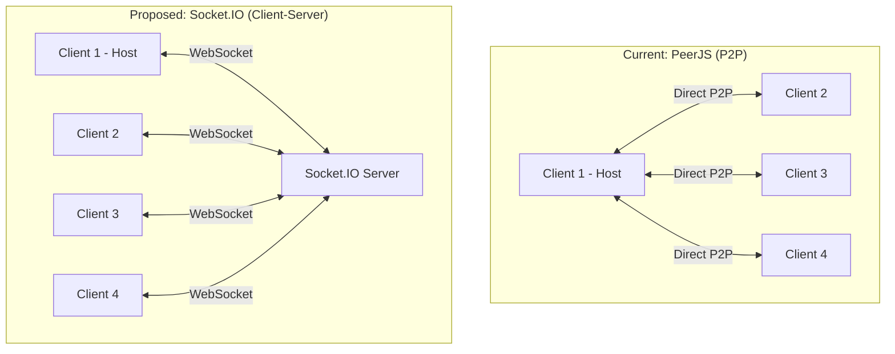

# PeerJS vs WebSocket Implementation Comparison

This document compares the current PeerJS implementation with the proposed WebSocket (Socket.IO) implementation for the Undercover Word Game.

## Architecture Comparison

## Key Differences

| Aspect | Current PeerJS Implementation | Proposed Socket.IO Implementation |
|--------|------------------------------|----------------------------------|
| **Network Compatibility** | Limited by NAT traversal, may not work across different networks | Works across different networks, NATs, and firewalls |
| **Connection Model** | Peer-to-peer (P2P) | Client-server |
| **State Management** | Host client manages game state | Server manages game state |
| **Reliability** | Depends on host client's connection | More reliable with server-side state management |
| **Scalability** | Limited by host client's bandwidth | Better scalability with dedicated server |
| **Reconnection** | Limited reconnection capabilities | Robust reconnection handling |
| **Implementation Complexity** | Simpler (no server required) | More complex (requires server setup) |
| **Deployment** | Client-side only | Requires server deployment |

## Code Changes Required

### 1. Server-Side (New)

- Create a Node.js server with Socket.IO
- Implement game room management
- Handle game state synchronization
- Process game events

### 2. Client-Side

| Current (PeerJS) | Proposed (Socket.IO) |
|------------------|----------------------|
| `PeerContext.tsx` | `WebSocketContext.tsx` |
| Direct peer connections | Connection to central server |
| Host manages all game logic | Server coordinates game logic |
| Manual NAT traversal | Handled by WebSocket protocol |

### 3. MultiplayerSetup Component

| Current (PeerJS) | Proposed (Socket.IO) |
|------------------|----------------------|
| Share peer ID | Share room code |
| Direct connection to host | Connection to server with room code |
| No connection status | Server connection status |

## Migration Path

1. Implement the server component
2. Create the WebSocketContext as a replacement for PeerContext
3. Update the MultiplayerSetup component
4. Test both implementations in parallel
5. Switch to the new implementation when ready

## Benefits of Migration

1. **Cross-Network Play**: Players can join from different networks without issues
2. **Improved Reliability**: Better handling of disconnections and network issues
3. **Centralized Logic**: Game state management is more consistent
4. **Future Scalability**: Easier to add features like persistent game rooms, matchmaking, etc.
5. **Better Security**: Server can validate game actions and prevent cheating

## Challenges

1. **Server Hosting**: Need to host and maintain a server
2. **Deployment Complexity**: More complex deployment process
3. **Cost**: Potential hosting costs for the server
4. **Maintenance**: Server requires monitoring and updates

## Conclusion

While the current PeerJS implementation is simpler and requires no server, the proposed Socket.IO implementation offers significant advantages in terms of network compatibility, reliability, and scalability. The migration requires creating a server component and updating the client code, but the benefits for players being able to connect from different networks make it worthwhile.