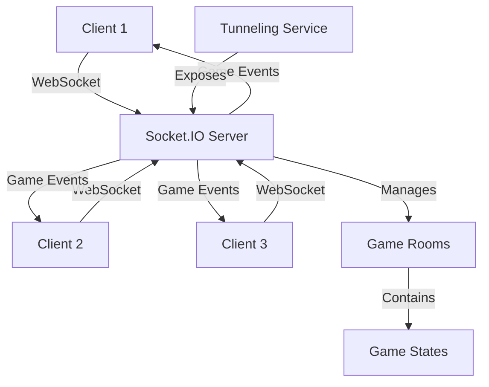

# Undercover Word Game - WebSocket Implementation

This project implements a WebSocket server for the Undercover Word Game, allowing players to connect from different networks. This README provides an overview of the implementation and links to detailed documentation.

## Overview

The current implementation of the Undercover Word Game uses PeerJS for peer-to-peer connections, which works well for local networks but has limitations when players are on different networks due to NAT traversal issues and firewall restrictions.

This implementation replaces the peer-to-peer architecture with a client-server architecture using Socket.IO, which provides better cross-network compatibility, improved reliability, and centralized game state management.

## Documentation

### Implementation Plan

The [Implementation Plan](websocket-server-implementation-plan.md) provides detailed step-by-step instructions for implementing both the server and client components of the WebSocket solution. It includes:

- Server-side implementation details
- Client-side code changes
- Environment configuration
- Deployment instructions

### Architecture Summary

The [Architecture Summary](websocket-server-summary.md) provides a high-level overview of the WebSocket implementation, including:

- Architecture overview
- Key components
- Implementation steps
- Benefits over the current implementation
- Deployment options

### PeerJS vs WebSocket Comparison

The [Comparison Document](peer-vs-websocket-comparison.md) compares the current PeerJS implementation with the proposed WebSocket implementation, highlighting:

- Architecture differences
- Key advantages and disadvantages
- Code changes required
- Migration path
- Benefits and challenges

### Troubleshooting Guide

The [Troubleshooting Guide](websocket-server-troubleshooting.md) addresses common issues that might arise during implementation and deployment, including:

- Server-side issues
- Client-side issues
- Tunneling issues
- Deployment issues
- Performance issues
- Debugging tips

### Server README

The [Server README](server/README.md) provides a quick reference for setting up and running the WebSocket server, including:

- Installation instructions
- Project structure
- API documentation
- Environment variables
- Deployment instructions

## Implementation Steps

1. **Set up the server project**
   - Create the server directory structure
   - Install required dependencies
   - Configure TypeScript

2. **Implement the server components**
   - Create the main server entry point
   - Implement game room management
   - Add event handlers for game actions

3. **Modify the client code**
   - Create a WebSocketContext to replace PeerContext
   - Update the MultiplayerSetup component
   - Implement reconnection handling

4. **Configure environment variables**
   - Set up development environment
   - Configure production settings

5. **Set up tunneling**
   - Configure ngrok or Cloudflare Tunnel
   - Test cross-network connectivity

## Architecture Diagram

## Benefits

1. **Cross-Network Play**: Players can connect from different networks without NAT traversal issues
2. **Improved Reliability**: Better handling of disconnections and network issues
3. **Centralized Logic**: Game state management is more consistent
4. **Future Scalability**: Easier to add features like persistent game rooms, matchmaking, etc.

## Getting Started

To get started with the implementation, follow these steps:

1. Read the [Implementation Plan](websocket-server-implementation-plan.md) to understand the overall approach
2. Set up the server project according to the instructions
3. Implement the server components
4. Modify the client code to use WebSockets
5. Test the implementation locally
6. Deploy to your chosen infrastructure
7. Configure tunneling for internet access

## Conclusion

This WebSocket implementation provides a robust solution for allowing players to connect from different networks, improving the game's accessibility and reliability. The detailed documentation provides all the information needed to implement, deploy, and troubleshoot the solution.